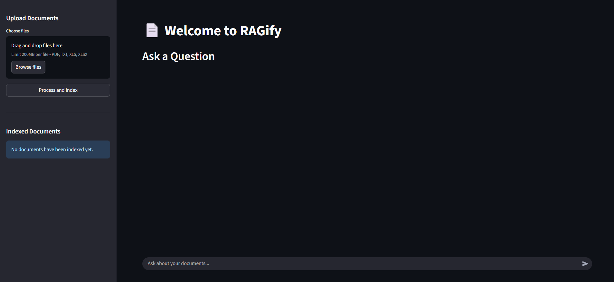
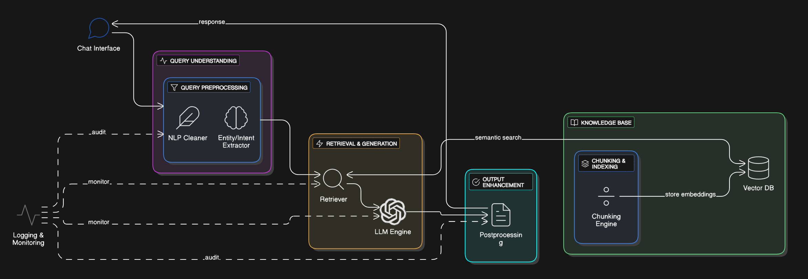

# RAGify - Document Q&A with AI

<!-- Tech Stack Badges -->
<p align="center">
  
  
  
  
  
</p>

**Enterprise Search, Reinvented.**  
**Theme:** AI in Business


> RAGify is an intelligent, full-stack application that allows you to chat with your documents. Upload PDFs, text, or Excel files and get instant, context-aware answers using a powerful **Retrieval-Augmented Generation (RAG)** pipeline.
>
> **Note:** The current frontend is built with **Streamlit** for rapid prototyping and ease of use.

---

## 📖 Table of Contents

- [About The Project](#-about-the-project)
- [✨ Key Features](#-key-features)
- [⚙️ Tech Stack](#️-tech-stack)
- [🏗️ Architecture](#️-architecture)
- [🚀 Getting Started](#-getting-started)
- [🔧 Usage](#-usage)
- [🔌 API Endpoints](#-api-endpoints)
- [👥 Authors](#-authors)

---

## 📖 About The Project

RAGify is a document Q&A platform that leverages **Retrieval-Augmented Generation (RAG)** to provide accurate, context-aware answers from your own documents. Users can upload PDFs, text files, or Excel spreadsheets, which are then processed and indexed for semantic search.

By combining advanced document parsing, vector search, and generative AI, RAGify makes large and complex documents easily searchable through natural language queries, saving time and unlocking insights from your data.



---

## ✨ Key Features

-   **Interactive Q&A:** Chat with your documents using natural language and receive real-time, context-aware answers.
-   **Multi-File Support:** Natively handles various formats, including **PDF (.pdf)**, **Plain Text (.txt)**, and **Excel Spreadsheets (.xls, .xlsx)**.
-   **Advanced PDF Parsing:** Intelligently extracts not just text but also complex **tabular data** from PDFs, making all content fully searchable.
-   **Dynamic Knowledge Base:** Easily **upload** and **delete** documents to manage the system's knowledge base on the fly.
-   **Source Verification:** Provides references to the source documents used to generate an answer, ensuring transparency and trust.

---

## ⚙️ Tech Stack

This project is built with a modern, full-stack architecture, leveraging powerful tools for both AI processing and user interaction.

-   **Backend:** **FastAPI**, **Uvicorn**
-   **Frontend UI:** **Streamlit**
-   **AI & Data:**
    -   **LangChain:** Core framework for orchestrating the RAG pipeline.
    -   **Google Generative AI:** For state-of-the-art text embeddings and generation models.
    -   **Pinecone:** Scalable vector database for efficient similarity search.
    -   **PyMuPDF & Pandas:** For robust parsing of PDF and Excel files.
-   **Development & Tooling:**
    -   **Git:** For version control.
    -   **python-dotenv:** For managing environment variables and API keys.

---

## 🏗️ Architecture

RAGify operates on a decoupled architecture, separating the core logic from the user interface.



-   **Core RAG Engine (`rag_api/rag.py`):** A Python module that handles all the heavy lifting: parsing documents, creating embeddings, querying the vector database, and generating answers.
-   **FastAPI Backend (`main.py`):** A robust API layer that exposes the RAG engine's functionality through simple RESTful endpoints. It manages file processing, user queries, and interaction with the Pinecone database.
-   **Streamlit UI (`app.py`):** A clean and interactive web interface that allows users to easily upload documents and engage in a Q&A chat session.

#### **Typical Flow:**

1.  A user uploads a document via the **Streamlit frontend**.
2.  The frontend sends the file to the **FastAPI backend's** `/upload` endpoint.
3.  The backend's **RAG Engine** processes the file, extracts content, generates embeddings, and stores them in **Pinecone**.
4.  The user asks a question in the chat interface.
5.  The backend retrieves the most relevant document chunks from Pinecone and feeds them, along with the query, to the **Google Generative AI** model.
6.  The generated answer is streamed back to the user's interface.

---

## 🚀 Getting Started

Follow these instructions to set up and run the project on your local machine.

### Prerequisites

-   Python 3.8+
-   A virtual environment tool (e.g., `venv`)
-   API keys for **Google AI** and **Pinecone**

### Installation

1.  **Clone the repository:**
    ```sh
    git clone <YOUR_REPOSITORY_URL>
    cd <YOUR_PROJECT_DIRECTORY>
    ```

2.  **Create and activate a virtual environment:**
    ```sh
    python -m venv venv
    venv\Scripts\activate   
    ```

3.  **Install the required dependencies:**
    ```sh
    pip install -r requirements.txt
    ```

4.  **Set up your environment variables:**
    Create a file named `.env` in the root directory and add your API keys:
    ```env
    GOOGLE_API_KEY="YOUR_GOOGLE_API_KEY"
    PINECONE_API_KEY="YOUR_PINECONE_API_KEY"
    ```

---

## 🔧 Usage

You will need to run two processes in separate terminals: the FastAPI backend and the Streamlit frontend.

1.  **Start the FastAPI Backend Server (Terminal 1):**
    ```sh
    uvicorn main:app --reload
    ```
    This will start the API server, typically at `http://127.0.0.1:8000`.

2.  **Run the Streamlit Frontend (Terminal 2):**
    ```sh
    streamlit run app.py
    ```
    This will launch the web application, typically at `http://127.0.0.1:8501`.

3.  **Open and Interact:**
    Open the Streamlit URL (`http://127.0.0.1:8501`) in your browser to start using the application.

---

## 🔌 API Endpoints

The backend provides the following RESTful API endpoints, which are consumed by the frontend.

| Method | Endpoint          | Description                               |
| :----- | :---------------- | :---------------------------------------- |
| `POST` | `/upload/`        | Handles file uploads and indexes them.    |
| `POST` | `/ask/`           | Receives a question and returns an answer.|
| `POST` | `/delete_document/` | Deletes a document and its vectors.     |

---

## 👥 Authors
-   **Manas Pawar** (PICT, Pune IT 2027)
-   **Soham Dawkhar** (PICT, Pune ECE 2027)
-   **Aditya Potdar** (PICT, Pune ECE 2027)
